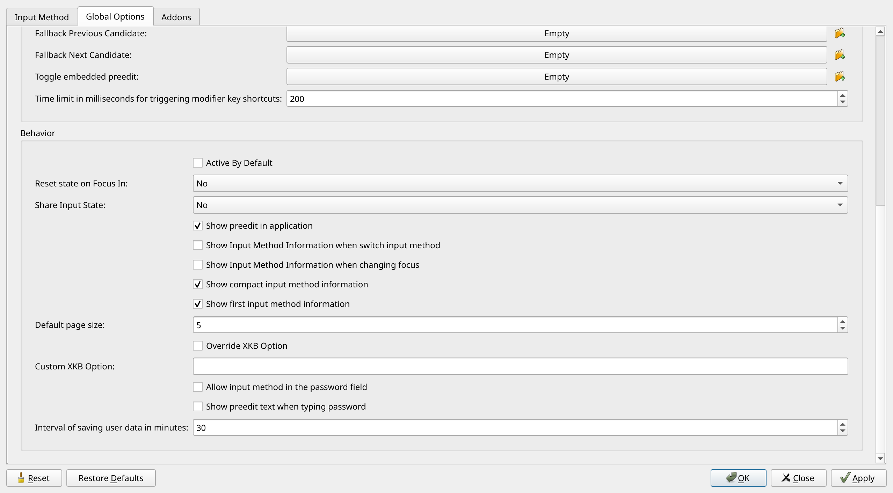

# Korean Localization on Arch Linux (Hyprland)

This guide covers the setup of Korean fonts and input methods on Arch Linux with Hyprland.

## 1. Install Korean Fonts

To ensure proper font rendering, install the following packages:

```sh
sudo pacman -S adobe-source-han-sans-kr-fonts adobe-source-han-serif-kr-fonts
```

## 2. Install Fcitx5 Input Method

Fcitx5 is a modern input method framework supporting Hangul (Korean).

```sh
yay -S fcitx5-im fcitx5-hangul fcitx5-configtool
```

## 3. Configure Environment Variables

Add the following lines to `~/.profile` and ensure `.bashrc` sources it:

```sh
export GLFW_IM_MODULE=fcitx # Needed for some Wayland applications
export GTK_IM_MODULE=wayland
export QT_IM_MODULE=fcitx
export SDL_IM_MODULE=fcitx
export XMODIFIERS=@im=fcitx
```

To apply the changes immediately, run:

```sh
source ~/.profile
```

## 4. Autostart Fcitx5 in Hyprland

Add the following line to your `~/.config/hypr/hyprland.conf` to start Fcitx5 automatically:

```ini
exec-once = fcitx5 -d
```

## 5. Configure Fcitx5

Launch the configuration tool via terminal:

```sh
fcitx5-configtool
```

Or use `wofi` (Hyprland's application launcher):

```sh
wofi --show drun
```

### Input Method Setup

1. Navigate to the **Input Method** tab.
2. Add **Hangul** to the **Current Input Method** list.

### Global Options Configuration

1. Move to the **Global Options** tab.
2. Set **Trigger Input Method** to **Right Alt (R_Alt)** for easy switching.

- uncheck `Show Input Method Information when switch input method`



## 6. Verify Installation

To confirm Fcitx5 is working correctly, restart your session or run:

```sh
fcitx5-diagnose
```

If everything is set up correctly, you should be able to type in Korean by pressing the **Right Alt** key to switch input methods.
