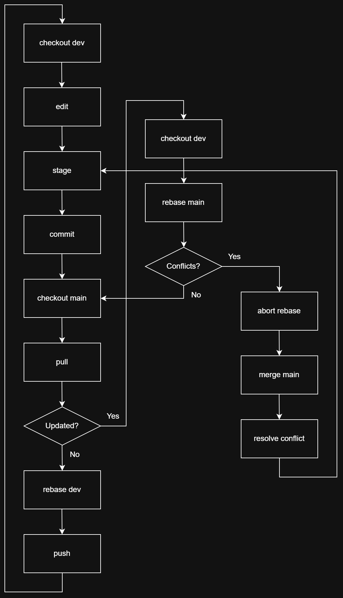

# Git

How to use [Git](https://git-scm.com/) with terminal commands or with [Sourcetree](https://www.sourcetreeapp.com/)

## Table of Contents

<!-- TODO: just do it -->

install git, sourcetree

git terminal commands

simple work flow

full work flow with sourcetree

vscode git extensions

---

  <h2>Flow Chart</h2>

  

