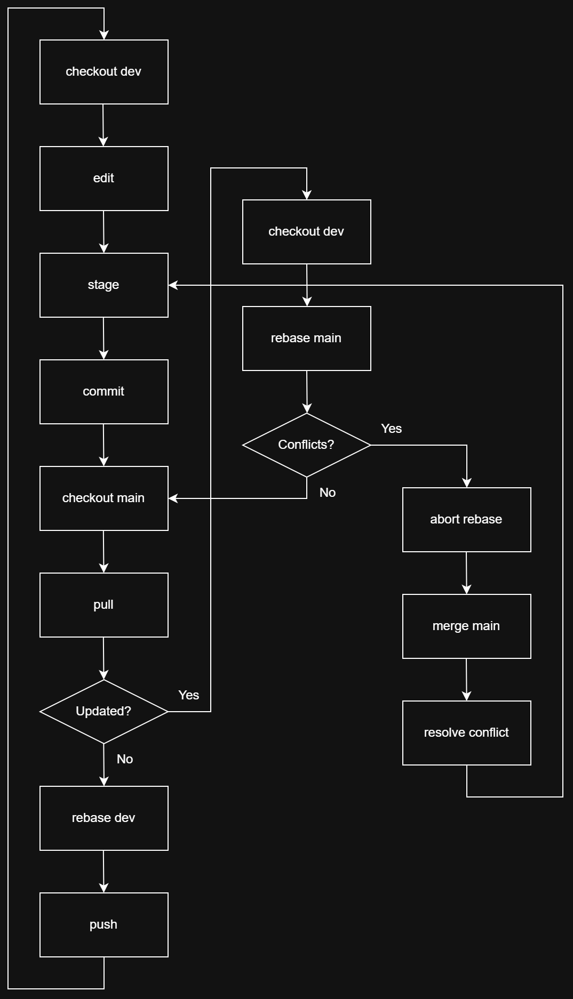

# [Git](https://git-scm.com/)

Version control system developed by [Linus Torvalds](https://github.com/torvalds) just about in 2 weeks.

## Table of Contents

- [Flowchart](#flowchart)
- [Reset Commit History](#reset-commit-history)
- [Pull Remote Branch](#pull-remote-branch)
- [Stop Tracking Ignored](#stop-tracking-ignored)
- [Worktree](#worktree)

---

## Flowchart

Commit, pull and push flow with one tracking branch (`main`) and one local branch (`dev`).

Drawn with [Draw.io](https://www.drawio.com/).



> [!NOTE]
> Not necessarily have to pull again right after checking that there was no
> conflict with the `dev` branch. If there was no conflict, just push it right away.

---

## Reset Commit History

> [!WARNING]
> Nuclear launch detected.

```sh
git checkout --orphan tmp # new branch with no commit history
git add -A
git commit -m "first commit"
git branch -D main        # remove main branch
git branch -m main        # rename current branch to main
git push -f origin main   # force push
```

---

## Pull Remote Branch

When two branches have unrelated commit histories.

```sh
git fetch origin               # downloads remote changes without affecting locals
git checkout -b dev origin/dev # create `dev` branch which tracks `origin/dev` and checkout to `dev`
```

---

## Stop Tracking Ignored

After adding files to `.gitignore` which are already being tracked.

```sh
git rm -r --cached .
git add -A
git commit -m "untrack ignored"
git push
```

--

## Worktree

When you have uncommitted changes but have to work on something else.

### List

```sh
git worktree list
```

### Create

Create `foo` project that have `feature/<bar>` branch checked out.

```sh
git worktree add ../<foo> -b feature/<bar>

git worktree add ../<foo> feature/<bazz> # use existing branch
```

Edit and commit normally from new worktree.

### Remove

```sh
git worktree remove ../<foo>

git branch -d feature/<bar> # remove merged

git branch -D feature/<bar> # or remove unmerged
```

### Prune

Clean up stale worktree metadata.

```sh
git worktree prune
```
